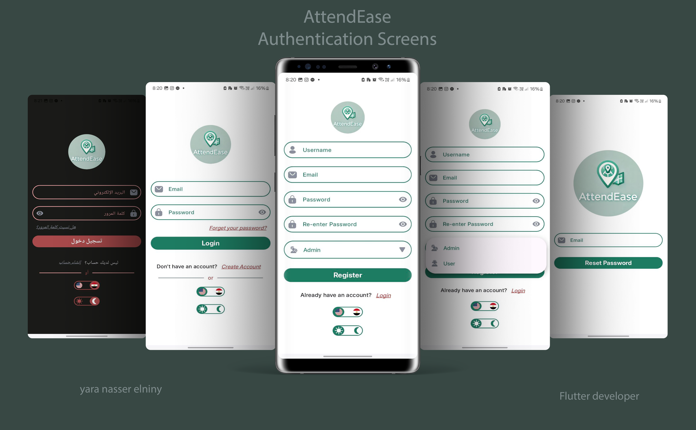

# AttendEase

## Getting Started

This project is a starting point for AttendEase application.

AttendEase is a location-based attendance tracking system for automating check-ins and check-outs using GPS. Reduces manual errors and improves accuracy. Enhances efficiency for organizations and users.

This application is developed as a graduation project for [Mobile Development By Flutter Bootcamp](https://sprints.ai/en-eg/journeys/MobileDevelopmentbyFlutterBootCamp-7270645) at [Sprints](https://sprints.ai/en-eg) using clean architecture with **MVVM pattern**, **Bloc & Cubit** for state management, and **firebase** for online/offline backend services.

## 📸 Screens

 

 

 

 

 

 

 

## ✨ Features:

- **Firebase Auth:** login | register via user name and password, forgot password.
- **FireStore database:** store and retrieving data using express queries.
- **Client-Side Validation** on login, register, forgot password pages.
- Real-time Updates via **Firestore Database.**
- data caching for offline use via **Hive, Shared Prefrences,Hydrated Bloc**.
- Animations ( Lottie, Explicit & implicit Animations).
- Custom Light/Dark Mode.
- Modern UI with New Material Widgets ([Yara Elniny](https://github.com/yara30999) Designed the App).
- Support both **Arabic and English** locales.(with ability to extend)
- **Search** functionality, applying debounce mechanism.
- Integration with Google Map API service (Location, Navigation, Pick from the map).
- Integration with GeoLocation service (get current user location, check-in based on the distance between group-location & user-location).
- Keeps the user session logged in. No need to log in every time the app is opened.
- **_Admin based features:_**
  - Create groups | Delete groups | Delete users from group.
  - Monitor each user Records & Permissions.
  - Access to each group Password.
- **_User based features:_**
  - Join only one group.
  - Check-in based on group location & time.
  - Check-out with no constraints.
  - Ability to take permission in active working days.
  - Access to it's own Records & Permissions.

## 📐 How to set-up this project on local machine?

- Fork this project

- Then clone the forked project by

  `git clone github.com/yara30999/AttendEase`

- once cloned, open this project in your favorite code-editor and run: `flutter pub get`
- Wohoo!! now you can now run this project on your emulator or physical device just do `flutter run`

## 📦 App Apk:

[Click here to download the AttendEase apk.](https://drive.google.com/file/d/1T0n3A07V3FTT7Fw7OB6ikqNYVQJ8wK8r/view?usp=drive_link)

## 🎥 App demo:

[Click here to watch AttendEase demo.](https://drive.google.com/file/d/1-WslniDr_FSy4SkJKmM_v58mkQtqrg21/view?usp=sharing)

## 💬 Feedback and Suggestions:

For any feedback or suggestions, feel free to contact me via email:  
📧 [yaranaserelniny30999@gmail.com](mailto:yaranaserelniny30999@gmail.com)

## 👥 Sprinters Team

- [Eng. Yara Nasser Elniny](https://github.com/yara30999)
- [Eng. Roaa Gawish](https://github.com/roaagawish)
- [Eng. Aya Mohammed](https://github.com/ayaelsherif21)
- [Eng. Abdelrahman Essam](https://github.com/abdo-essam)
- [Eng. Ahmed Magdy](https://github.com/AhmedMagdy9876)
- [Eng. Gehad Taymoor](https://github.com/GehadTaymoor)

## Enjoy! 💕

If you like this project, don't forget to give it a star ⭐ and fork this project.
